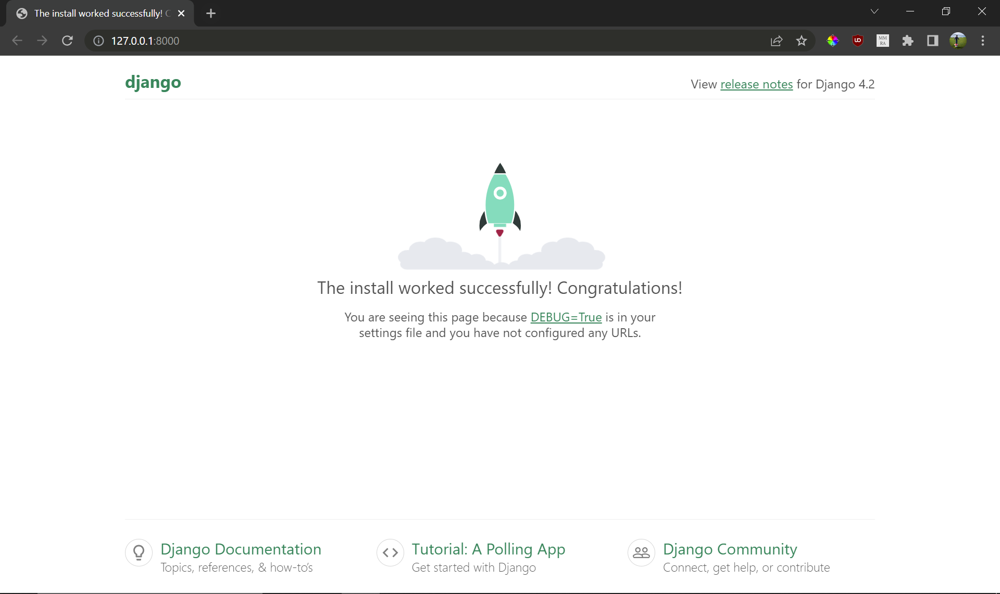

# Module 5. Backend Code-along

Now, with the knowledge of how the backend is structured, we can build the Local Library site in a fresh directory (or build something totally new, it's up to you)! You can always refer to the local library code in ```example2-locallibrary/``` if you get stuck.

## Workflow Overview
- Step 1. Define your data model 
- Step 2. Define your API endpoints and expected behaviour
- Step 3. Implement data model in models.py
- Step 4. Implement APIs in views.py + urls.py
- Step 5. Test using Postman or Requests

## 1 Design Work

1. Define a data model for a Library consisting of 2 objects: Books and Authors, with a foreign-key relationship.

2. Define the API. Let's do three arbitrary queries first as an example, then we can do up the rest (CRUD-like) later.
    - Get all books written by Author with ID1
    - Get all books 
    - Edit the author of a book

## 2 Setup

1. Create a fresh directory for your project, and set that directory as your current working directory.
```mkdir backend-worked```
```cd backend-worked```

2. Create a new python environment. Install ```django```.

3. Initialise your project with ```django-admin startproject locallibrary .``` The ```.``` means to create the project in the current working directory rather than creating a subfolder for hte project.

4. Initialise the book app with ```django-admin startapp book```

5. Initialise the author app with ```django-admin startapp author```

6. Add ```author``` and ```book``` to the list of INSTALLED_APPS in ```settings.py```

7. Verify this works by running ```python manage.py runserver```

8. Run migration. Migrations are necessary whenever the data model changes as the app goes along (since we are changing our database schema). It can cause errors eg. when we make a breaking change -> so sometimes we need to delete all the migrations and start afresh which is annoying. Since we are initialising the database, it is a change.
    - ```python manage.py makemigrations```: Defines the operations needed to migrate data to new schema
    - ```python manage.py migrate```: Executes the operations

9. Rerun ```python manage.py runserver``` Now you should see:



10. Create a readme file in the root directory of the project to remind yourself of how to run the project.

11. Create a requirements.txt file by using ```pip freeze``` or typing in manualy.


## Implementation of Data Model

1. In ```book/models.py``` create a ```book``` object with the following fields:
- ```title:String```
- ```author:Foreign Key to Author```
- ```pages:int```

2. In ```author/models.py``` create an ```author``` object with the following fields
- ```name:String```
- ```age:int```

## Implementation of API Endpoints 

1. Implement the endpoints using any method you fancy

## Testing
Test all endpoints using Postman or python requests. Send both legal and illegal requests. Observe what the response is in both cases.

## Points of Discussion

- Do you notice any potential issues with your design (in terms of API endpoint design and data modelling)?
- How do you think the application might need to change as your application evolves (eg. new fields need to be added, data model changes, etc.)?  
- Does your application sufficiently model the real world and fulfil the user requirements?

